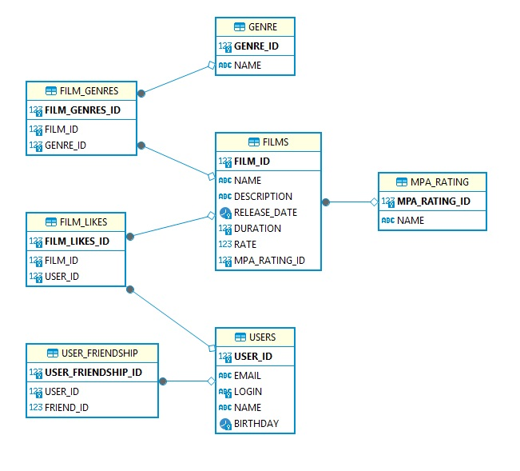

# java-filmorate
Template repository for Filmorate project.

## База данных приложения Filmorate.

ER-диаграмма базы данных:



Примеры SQL запросов к БД:

1. Получение списка всех фильмов:
```
SELECT *
FROM film;
```
2. Получение списка всех пользователей:
```
SELECT *
FROM user;
```
3. Получение фильма по id (в примере ищем фильм с id = 1):
```
SELECT *
FROM film
WHEN film_id = 1;
```
4. Получение пользователя по id (в примере ищем пользователя с id = 1):
```
SELECT *
FROM user
WHEN user_id = 1;
```
5. Получаем список топ фильмов по количеству лайков (в примере ищем топ 10 фильмов):
```
SELECT *
FROM film
ORDER BY likes_quantity DESC
LIMIT 10;
```
6. Получаем список друзей пользователя (например пользователя с id = 1):
```
SELECT *
FROM user
WHEN user_id IN (SELECT friend_id
                 FROM user_friendship
                 WHEN user_id = 1);
```
7. Получаем список общих друзей двух пользователей (id пользователей 1 и 2):
```
SELECT *
FROM user
WHEN user_id IN (SELECT friend_id
                 FROM user_friendship
                 WHEN user_id = 2
                      AND friend_id IN (SELECT friend_id
                                        FROM user_friendship
                                        WHEN userd_id = 1));
```