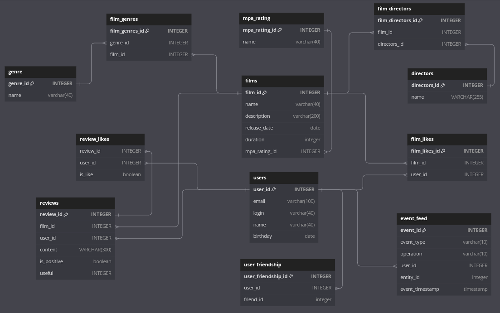

# java-filmorate
Template repository for Filmorate project.

## База данных приложения Filmorate.

ER-диаграмма базы данных:



Примеры SQL запросов к БД:

1. Получение списка всех фильмов:
```
SELECT f.film_id,
       f.name,
       f.release_date,
       f.description,
       f.duration,
       mp.mpa_rating_id,
       mp.name AS mpa_name
FROM films AS f
JOIN mpa_rating AS mp ON (f.mpa_rating_id = mp.mpa_rating_id);
```
2. Получение списка всех пользователей:
```
SELECT *
FROM users;
```
3. Получение фильма по id (в примере ищем фильм с id = 1):
```
SELECT f.film_id,
       f.name,
       f.release_date,
       f.description,
       f.duration,
       mp.mpa_rating_id,
       mp.name AS mpa_name
FROM films AS f
JOIN mpa_rating AS mp ON (f.mpa_rating_id = mp.mpa_rating_id)
WHERE film_id = 1;
```
4. Получение пользователя по id (в примере ищем пользователя с id = 1):
```
SELECT *
FROM users
WHERE user_id = 1;
```
5. Получаем список топ фильмов по количеству лайков (в примере ищем топ 10 фильмов):
```
SELECT f.film_id,
       f.name,
       f.release_date,
       f.description,
       f.duration,
       mp.mpa_rating_id,
       mp.name AS mpa_name
FROM films AS f
LEFT OUTER JOIN mpa_rating AS mp ON (f.mpa_rating_id = mp.mpa_rating_id)
LEFT OUTER JOIN film_likes AS fl ON (f.film_id = fl.film_id)
GROUP BY f.film_id,
         fl.user_id
ORDER BY COUNT(fl.user_id) DESC
LIMIT 10;
```
6. Получаем список друзей пользователя (например пользователя с id = 1):
```
SELECT u.user_id,
       u.email,
       u.login,
       u.name,
       u.birthday
FROM users AS u
JOIN user_friendship AS uf ON (u.user_id = uf.friend_id)
WHERE uf.user_id = 1;
```
7. Получаем список общих друзей двух пользователей (id пользователей 1 и 2):
```
SELECT u.user_id,
       u.email,
       u.login,
       u.name,
       u.birthday
FROM users AS u
JOIN user_friendship AS uf1 ON (u.user_id = uf1.friend_id)
JOIN user_friendship AS uf2 ON (uf1.friend_id = uf2.friend_id)
WHERE uf1.user_id = 1
  AND uf2.user_id = 2;
```
8. Получение жанра фильма по id (в примере ищем жанр с id = 1):
```
SELECT *
FROM genre " +
WHERE genre_id = 1;
```
9. Получение списка всех жанров:
```
SELECT *
FROM genre;
```
10. Получение MPA-рейтинга по id (в примере ищем MPA-рейтинг с id = 1):
```
SELECT *
FROM mpa_rating
WHERE mpa_rating_id = 1;
```
11. Получение списка всех MPA-жанров:
```
"SELECT *
FROM mpa_rating;
```

## Ссылки.

Ссылка на канбан-доску, с распределением задач между членами команды:

https://github.com/users/alekslit/projects/1/views/1